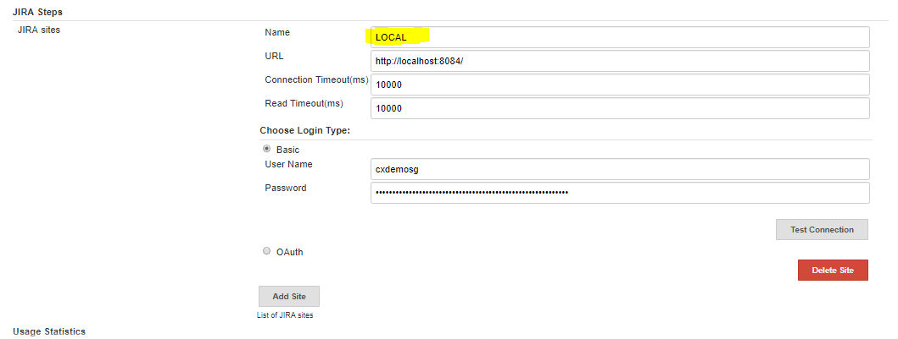
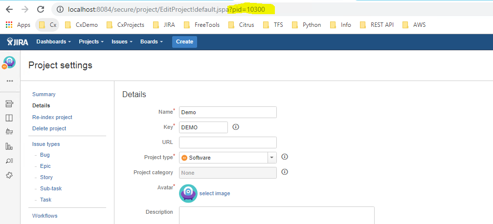
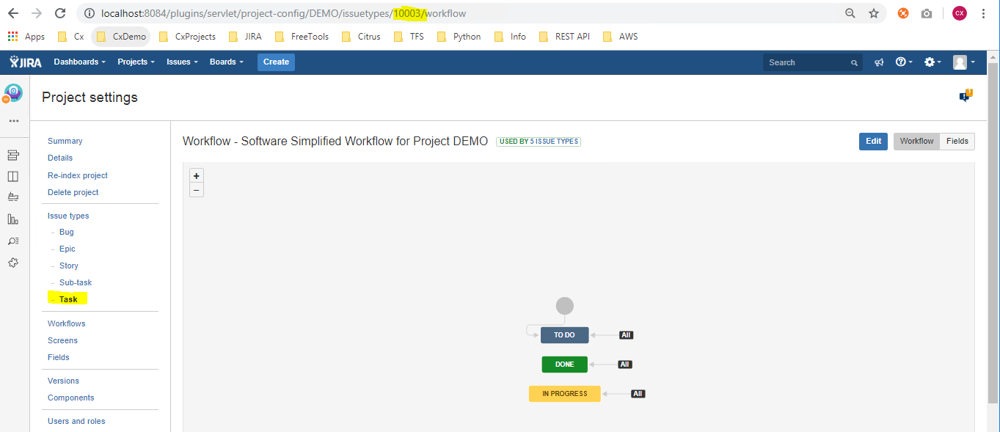

# Jenkins Pipeline to push JIRA ticket with SAST findings
* Author:   Pedric Kng  
* Updated:  02 April 2019

This article describes the steps to capture the SAST findings as part of the Jenkins Pipeline and manage the risk via JIRA.

The Jenkins pipeline is described below;
1. Execute SAST scan using Checkmarx plugin with vulnerability threshold enabled
2. Post to the scan, the build will be flagged as failure or unstable should the threshold be exceeded
3. Inspect the Checkmarx XML report residing in the Jenkins workspace for the vulnerability result count based on severity
4. Send a JIRA ticket containing the result count

Note that the sample given is based on Declarative Pipeline but it will work for Scripting Pipeline with slight changes.

***
## Dependencies
- JIRA Pipeline Steps Plugin  
  The JIRA jenkins plugin supports various pipeline step, 'jiraNewIssue' [[4]] will be used to push the ticket containing the scan result count
- Checkmarx Jenkins plugin  
  The Checkmarx plugin supports capability to execute scans and fail builds upon exceeding severity vulnerability threshold

## Setup

### Install the JIRA Pipeline plugin
1. Follow the instructions in [[2]] to install the plugin in Jenkins
2. In Jenkins, add a JIRA site in <i>Manage Jenkins → Configure System → JIRA Steps → JIRA sites</i>
  - <a name="JiraSiteName"></a>Name: Jira site name e.g., LOCAL, will be available in the Jenkins environment as 'JIRA_SITE'
  - URL: Jira instance URL e.g., http://localhost:8084
  - Connection Timeout: (leave default)
  - Read Timeout: (leave default)
  - Login Type: (credential to login to JIRA instance e.g., username/password or OAuth)

  


3. Please note down the following JIRA fields, these is to be configured in the Jenkins Pipeline script later;
  - <a name="ProjectId"></a>Jira Project Id: Id of Jira project e.g., 10300

    <i>JIRA Dashboard → Administration → [project] → project settings → Details</i>
    

  - <a name="IssueTypeId"></a>Jira Issuetype Id: Id of Issuetype in JIRA project to create the issue e.g., 10003

    <i>JIRA Dashboard → Administration → [project] → project settings → Issue Types → [Issue Type]</i>
    


### Checkmarx CxSAST Plugin
3. Follow the instructions[[1]] to install and configure the Checkmarx Jenkins plugin respectively


### Add Shared Library in Jenkins
4. In Jenkins, go to <i>Manage Jenkins → Configure System</i>. Under Global Pipeline Libraries, add a library with the following settings:
  - Name: pipeline-library-demo
  - Default version: Specify a Git reference (branch or commit SHA), e.g. master
  - Retrieval method: Modern SCM
  - Select the Git type
  - Project repository: https://github.com/cx-demo/cx_groovy.git
  - Credentials: (leave blank)

The shared library [cx_groovy](vars/parseXMLReport.md) used in this tutorial will parse the Checkmarx XML report and return a Map containing results by severity; High, Medium, Low, Information

### Add job to Jenkins Pipeline
5. Add your Checkmarx CxSAST credential to the Jenkins credentials manager. In Jenkins, go to <i>Credential → System  → Global credentials → Add credentials</i>.  
  - Kind: Username with password
  - Scope:  (as required)
  - Username: CxSAST login username
  - Password: CxSAST login password
  - ID: jenkins-checkmarx-cxsast-creds
  - Description: (as required)


6. Use the Jenkins Pipeline Syntax helper[[5]] to generate the CxSAST pipeline step, note the following key configurations:
  - Enable vulnerability threshold: True
  - Build status when results exceed threshold: Unstable
  - SAST High severity vulnerabilities threshold: (high severity vulnerability threshold)
  - SAST Medium severity vulnerabilities threshold: (medium severity vulnerability threshold)
  - SAST Low severity vulnerabilities threshold: (low severity vulnerability threshold)


7. Add CxSAST scan step to your pipeline

```groovy
stage('checkmarx') {
  environment {
    CX_CREDS  = credentials('jenkins-checkmarx-cxsast-creds')
  }
  steps{
    echo "Executing Checkmarx Jenkins Plugin to request a Scan..."
    step([$class: 'CxScanBuilder', comment: '', excludeFolders: '', excludeOpenSourceFolders: '', exclusionsSetting: 'job',
      filterPattern: '''!**/_cvs/**/*, !**/.svn/**/*,   !**/.hg/**/*,   !**/.git/**/*,  !**/.bzr/**/*, !**/bin/**/*,
        !**/obj/**/*,  !**/backup/**/*, !**/.idea/**/*, !**/*.DS_Store, !**/*.ipr,     !**/*.iws,
        !**/*.bak,     !**/*.tmp,       !**/*.aac,      !**/*.aif,      !**/*.iff,     !**/*.m3u, !**/*.mid, !**/*.mp3,
        !**/*.mpa,     !**/*.ra,        !**/*.wav,      !**/*.wma,      !**/*.3g2,     !**/*.3gp, !**/*.asf, !**/*.asx,
        !**/*.avi,     !**/*.flv,       !**/*.mov,      !**/*.mp4,      !**/*.mpg,     !**/*.rm,  !**/*.swf, !**/*.vob,
        !**/*.wmv,     !**/*.bmp,       !**/*.gif,      !**/*.jpg,      !**/*.png,     !**/*.psd, !**/*.tif, !**/*.swf,
        !**/*.jar,     !**/*.zip,       !**/*.rar,      !**/*.exe,      !**/*.dll,     !**/*.pdb, !**/*.7z,  !**/*.gz,
        !**/*.tar.gz,  !**/*.tar,       !**/*.gz,       !**/*.ahtm,     !**/*.ahtml,   !**/*.fhtml, !**/*.hdm,
        !**/*.hdml,    !**/*.hsql,      !**/*.ht,       !**/*.hta,      !**/*.htc,     !**/*.htd, !**/*.war, !**/*.ear,
        !**/*.htmls,   !**/*.ihtml,     !**/*.mht,      !**/*.mhtm,     !**/*.mhtml,   !**/*.ssi, !**/*.stm,
        !**/*.stml,    !**/*.ttml,      !**/*.txn,      !**/*.xhtm,   !**/*.class, !**/*.iml, !Checkmarx/Reports/*.*''',
      fullScanCycle: 10,
      fullScansScheduled: true,
      generatePdfReport: true,
      groupId: '00000000-1111-1111-b111-989c9070eb11',
      includeOpenSourceFolders: '',
      osaEnabled: false,
      username: "${CX_CREDS_USR}",
      password: "${CX_CREDS_PSW}",
      preset: '36',
      projectName: "${params.CX_PROJECT_NAME}",
      serverUrl: "${params.CX_SERVER_URL}",
      sourceEncoding: '1',
      waitForResultsEnabled: true,
      vulnerabilityThresholdEnabled: true,
      vulnerabilityThresholdResult: 'UNSTABLE',
      highThreshold: 1,
      lowThreshold: 1,
      mediumThreshold: 1,
      generatePdfReport: false])
  }
```

8. Add the shared library reference at the top of your pipeline

```groovy
@Library('pipeline-library-demo')_
```

9. Add a post 'unstable' step after the CxSAST as follows

  Note: the following fields should be changed accordingly in the script.
  - [Jira Site](#JiraSiteName) - See withEnv:JIRA_SITE
  - [ProjectId](#ProjectId) - See fields:project:id
  - [IssueTypeId](#IssueTypeId) - See fields:issuetype:id

```groovy
steps{
  echo "Executing Checkmarx Jenkins Plugin to request a Scan..."
  step([$class: 'CxScanBuilder',..
}
post{
  unstable {
    script {
        echo "This will always run"
        echo "Current build result: ${currentBuild.getCurrentResult()}"
        def reportFileUrl = "${env.WORKSPACE}/Checkmarx/Reports/ScanReport.xml";
        if ( fileExists(reportFileUrl) ) {
            echo 'report exists'

            def cxresults = parseXMLReport(reportFileUrl)
            echo "highs: ${cxresults.highs}"
            echo "mediums: ${cxresults.mediums}"
            echo "lows: ${cxresults.lows}"
            echo "infos: ${cxresults.infos}"

            withEnv(['JIRA_SITE=LOCAL']) {
              def testIssue = [fields: [ project: [id: '10300'],
                summary: '[UNSTABLE] New CxScan Results exceeded threshold',
                description: "Results highs: ${cxresults.highs}, mediums: ${cxresults.mediums}, lows: ${cxresults.lows}, infos: ${cxresults.infos}",
                issuetype: [id: '10003']]]

                response = jiraNewIssue issue: testIssue

                echo response.successful.toString()
                echo response.data.toString()
            }
        }
    }
}
```


[Sample Jenkins Pipeline](mycxsast.jenkinsfile)


# References
CxSAST Jenkins Plugin [[1]]  
Jenkins Pipeline Jira Steps Plugin [[2]]  
Extending with Shared Libraries [[3]]  
JIRA Steps: Create New Issues [[4]]  
Configuring a CxSAST Scan Action using Jenkins Pipeline [[5]]


[1]:https://checkmarx.atlassian.net/wiki/spaces/KC/pages/11337790/CxSAST+Jenkins+Plugin "CxSAST Jenkins Plugin"
[2]:https://jenkinsci.github.io/jira-steps-plugin/ "Jenkins Pipeline Jira Steps Plugin"
[3]:https://jenkins.io/doc/book/pipeline/shared-libraries/ "Extending with Shared Libraries"
[4]:https://jenkins.io/doc/pipeline/steps/jira-steps/#jiranewissues-jira-steps-create-new-issues "JIRA Steps: Create New Issues"
[5]:https://checkmarx.atlassian.net/wiki/spaces/KC/pages/57180267/Configuring+a+CxSAST+Scan+Action+using+Jenkins+Pipelines "Configuring a CxSAST Scan Action using Jenkins Pipeline"
